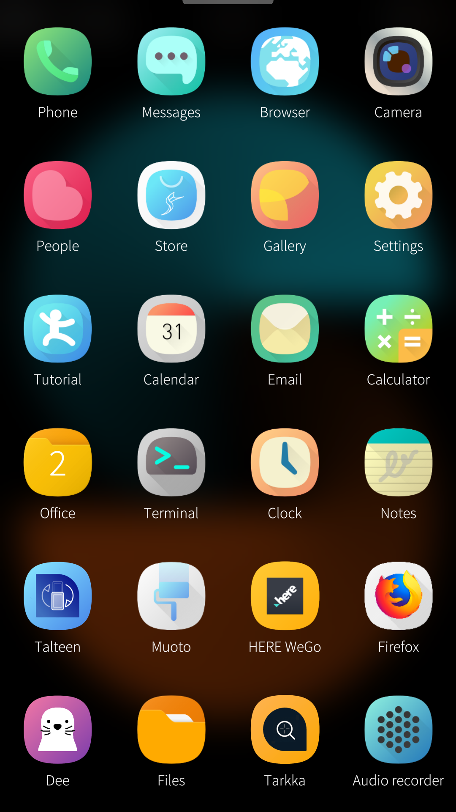

# Evolve Plus for Sailfish OS

Evolve Plus for Sailfish OS.

   

## Request a new icon

You can request a new icon via the theme companion app or by [opening an issue](https://github.com/uithemer/harbour-themepack-evolve-plus/issues).

## Create custom theme packs

Documentation on how to create theme packs available [here](https://uithemer.github.io/harbour-muoto/).

## Translate

Request a new language or contribute to existing languages on the [Transifex project page](https://explore.transifex.com/fravaccaro/evolve-plus/).

## Builds

Builds available [here](https://openrepos.net/content/fravaccaro/evolve-plus-icons).

## Credits

Icons by [WanMonstar](https://twitter.com/wanmonstar) and [Nfanliver](https://twitter.com/Nfanliver). Icons are released under [Creative Common BY-NC-SA 4.0](https://creativecommons.org/licenses/by-nc-sa/4.0/).
